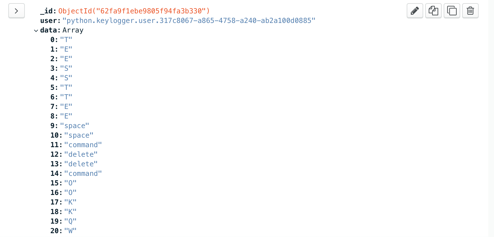

# Simple Remote Keylogger
## for macOS

## tools: mongoDB, requests, flask

* serverApi: will establish the connection to persist data to mongoDB
* clientApi: will upload data by http request to the host api
* backgroundCaptor: will capture keystrokes and save to text file
* dataRepository: connects to database

## How to use it:

* You must have an static dns so the client doesn't lost connection to the host api
* update the host and ports in the application to yours external dns and exposed port
* set up a mongo database, it can be local or at mongo atlas
* the client must run the background captor as admin and have the dependencies for de clientApi
* you can retrieve client data from your server api /fetch or from your mongodb database (recommend using the second option as the first one is insecure and for real use must be disabled)

## Improvements that can be made

* compile backgroundCaptor and dependencies as an executable file
* develop system persistence

## Current bugs:

* update user data without overwriting or writing a new register for the same client
* key 'A' is not always captured

Example fetching data from mongoDB:

